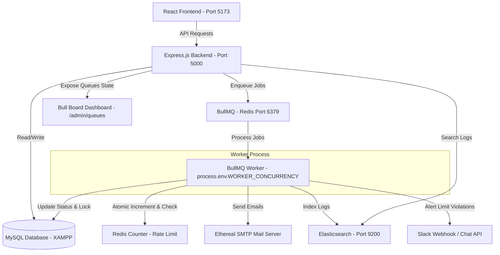

# ReachInbox Full-Stack Email Job Scheduler

A complete, production-grade email scheduling application built with a modern React + Express + MySQL monorepo architecture. 

It handles advanced queue scheduling, hourly rate limiting, database-level and queue-level idempotency, automatic Ethereal SMTP mail delivery, Elasticsearch logs search, Google & Slack OAuth logins and notifications, and provides a real-time BullMQ visualizer dashboard.

---

## Technical Architecture Overview



---

## Folder Structure

```text
reachinbox-email-scheduler/
├── backend/
│   ├── src/
│   │   ├── config/          # Client initializers (Prisma DB, Redis, Elasticsearch)
│   │   ├── controllers/     # Router endpoint handlers (Auth, Senders, Emails, Slack, Search)
│   │   ├── middleware/      # JWT Authentication validation guards
│   │   ├── routes/          # Express route bindings
│   │   ├── services/        # Nodemailer Ethereal SMTP transporter
│   │   ├── queues/          # BullMQ queue instantiators
│   │   ├── workers/         # BullMQ queue workers
│   │   ├── integrations/    # OAuth exchange API clients (Google, Slack)
│   │   ├── app.ts           # App setup, CORS configurations, Bull Board mount
│   │   └── server.ts        # Server entry point, db connects, port listener
│   ├── prisma/
│   │   └── schema.prisma    # Database schemas
│   ├── package.json
│   ├── tsconfig.json
│   └── .env.example
├── frontend/
│   ├── src/
│   │   ├── components/      # UI layouts (SendersManager, ComposeEmailModal)
│   │   ├── pages/           # Views (LoginPage, DashboardPage)
│   │   ├── layouts/         # Layout view wrapper (DashboardLayout)
│   │   ├── services/        # Axios API fetch wrappers
│   │   ├── context/         # AuthContext state provider
│   │   ├── types/           # TS Interfaces
│   │   ├── App.tsx          # Router configuration
│   │   └── main.tsx         # Render entrypoint
│   ├── package.json
│   ├── tsconfig.json
│   └── vite.config.ts
├── scripts/
│   └── create-test-emails.ts # Load testing CLI tool
├── docker-compose.yml       # Docker config (Redis + Elasticsearch)
├── README.md
└── .gitignore
```

---

## Core Infrastructure Setup

### Prerequisites
1. **Node.js**: v18 or v20 (LTS recommended)
2. **Docker Desktop**: For running Redis and Elasticsearch
3. **XAMPP**: Running MySQL on Windows (`localhost:3306`)

---

### Step 1: Start XAMPP & MySQL Database
1. Launch the **XAMPP Control Panel** on your Windows laptop.
2. Click **Start** next to **MySQL**.
3. Open your browser and head to **phpMyAdmin**: `http://localhost/phpmyadmin/`.
4. Click **New** in the left sidebar.
5. Create a database named exactly:
   ```text
   reachinbox
   ```

---

### Step 2: Start Redis & Elasticsearch via Docker
Start the required background containers by running this command in the project root:
```bash
docker compose up -d
```
Verify they are running successfully:
```bash
docker ps
```
*Note: Redis is mapped to `localhost:6379`, and Elasticsearch is mapped to `localhost:9200` with security disabled for developer convenience.*

To stop the containers when finished:
```bash
docker compose down
```

---

### Step 3: Configure Environment Variables
Inside the `backend/` directory, create a `.env` file (we have copied `.env.example` to `.env` for you).

#### Google OAuth Setup
1. Go to the [Google Cloud Console](https://console.cloud.google.com/).
2. Create a project and set up your OAuth Consent Screen.
3. Under Credentials, create **OAuth 2.0 Client IDs**.
4. Set Authorized Redirect URIs to:
   ```text
   http://localhost:5000/api/auth/google/callback
   ```
5. Copy Client ID and Client Secret into `backend/.env`.

#### Slack Integration Setup
1. Create a Slack App in your workspace on [Slack API](https://api.slack.com/apps).
2. Go to **OAuth & Permissions**.
3. Under Redirect URLs, add:
   ```text
   http://localhost:5000/api/slack/callback
   ```
4. Under **Scopes**, add `incoming-webhook` and `chat:write` as Bot Token scopes.
5. Copy Client ID and Client Secret into `backend/.env`.

#### Ethereal Email Setup
If `ETHEREAL_USER` and `ETHEREAL_PASSWORD` are left empty in `.env`, **the application will automatically create an Ethereal SMTP account on startup** and print details in the terminal console!

---

### Step 4: Run Prisma DB Migrations
Navigate to the `backend/` folder and execute:
```bash
# Generate Client SDK
npm run prisma:generate

# Deploy Schema migrations to MySQL database
npm run prisma:migrate
```

---

## Running the Application

For a complete demonstration, you will need **three terminal windows** open:

### Terminal 1: Start Backend Server
```bash
cd backend
npm run dev
```

### Terminal 2: Start BullMQ Worker
```bash
cd backend
npm run worker
```

### Terminal 3: Start React Frontend (Vite)
```bash
cd frontend
npm run dev
```
Open your browser to `http://localhost:5173`.

---

## Architectural & Integration Details

### 1. No Cron Job Requirement
Rather than scanning database records periodically (which causes database stress and query delays), scheduling utilizes **BullMQ Delayed Jobs** in Redis:
1. When a campaign is submitted, the backend calculates the exact execution time for each recipient.
2. An email task is added to BullMQ with a specific `delay` parameter (difference between execution time and now).
3. Redis stores these delayed jobs in a sorted set. When the time expires, BullMQ promotes it to the active queue for immediate processing by the worker.

### 2. Atomic Hourly Rate Limiting
To prevent race conditions where multiple parallel workers process emails at the same time and exceed the hourly rate limit:
- We use a **Redis-based atomic counter** using a Lua script:
  ```lua
  local current = redis.call('INCR', KEYS[1])
  if current == 1 then
    redis.call('EXPIRE', KEYS[1], tonumber(ARGV[1]))
  end
  return current
  ```
- If the incremented rate exceeds the campaign limit, the worker shifts the job's status to `RATE_LIMITED` and calculates the delay to the start of the next hour.
- It then schedules a new delayed BullMQ task to execute at the start of that next hour window.
- The sender rate key has an hourly sliding namespace: `email-rate:{senderId}:{YYYY-MM-DD-HH}`.

### 3. Idempotency & Locking
- A deterministic `idempotencyKey` is generated for every email: `campaign:{campaignId}:recipient:{recipient}`.
- Before transmission, the worker locks the email by transitioning its status from `SCHEDULED` to `PROCESSING` inside a MySQL conditional transaction query.
- If the status is already `SENT` or `PROCESSING`, the execution is immediately skipped.

### 4. Restart Resilience
Because task data and delays are persisted within Redis, stopping the Express server or the Worker process will not result in lost schedules. Once the processes boot up again, BullMQ automatically polls Redis and starts execution.

---

## Demo & Testing Scenarios

### Scenario 1: Standard Scheduling
1. Add a sender under **Email Senders** (e.g. name: "Sales", email: "sales@mycompany.com").
2. Click **Compose Campaign**.
3. Upload a CSV containing a few sample emails:
   ```text
   email
   john@gmail.com
   alice@gmail.com
   ```
4. Set delivery start time (e.g., 2 minutes in the future), delay to `5 seconds`, hourly limit to `200`.
5. Click **Schedule**. You will see the emails in the **Scheduled Queue** table.
6. When the time arrives, watch the status move to `PROCESSING` then `SENT`.
7. Click the **Preview** link next to any sent email to open Ethereal's actual message logs!

### Scenario 2: Simulate Rate Limiting & Slack Warnings
1. Schedule a campaign with a list of 5 emails.
2. In the compose modal, set the **Hourly Sending Limit** to a tiny number, such as `2`.
3. Set delay to `2 seconds`, start time to now.
4. Watch the worker execute the first 2 emails (status: `SENT`).
5. For the 3rd email, the worker registers a rate limit violation. The email status transitions to `RATE_LIMITED` and is rescheduled to execute exactly at the start of the next hour.
6. If Slack was connected, you will immediately receive a Slack channel message detailing the rate-limit warning.

### Scenario 3: Load Testing (100+ Emails)
We've included a CLI stress-testing utility to quickly populate the database and Redis queue:
```bash
# In the workspace root
npx tsx scripts/create-test-emails.ts 100
```
This utility bypasses frontend uploads, creates a mock campaign of 100 emails, schedules them sequentially, and sets a strict rate limit of `25` per hour. Open the Bull Board to watch the queue handle rate limitations and schedule offsets!

---

## Assumptions, Trade-offs & Future Improvements

### Assumptions
- **Local Sandbox Environment**: Elasticsearch is configured with security disabled for local testing. In production, HTTPS and basic auth should be enabled on the client.
- **SQLite Fallback**: We assumed MySQL is running through XAMPP on localhost. We implement a robust search fallback to MySQL contains queries if Elasticsearch happens to be offline or down.

### Trade-offs
- **BullMQ Storage**: We store only the reference ID of the email (`emailId`) in Redis, and fetch the full body from MySQL on worker pickup. This keeps Redis memory footprint very low, though it introduces a MySQL read query per email job.

### Future Improvements
- **HTML Rich Text Editor**: Integrate a rich text editor (like TipTap or Quill) on the frontend rather than standard textareas.
- **Detailed Analytics**: Add tracking pixels to email templates to calculate click-through rates and bounce alerts.
